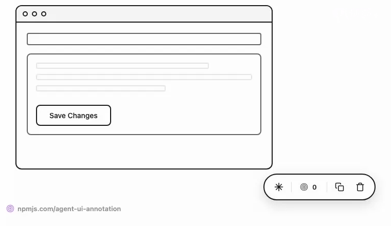

# agent-ui-annotation

[](https://www.npmjs.com/package/agent-ui-annotation)
[](https://www.npmjs.com/package/agent-ui-annotation)
[](https://github.com/YeomansIII/agent-ui-annotation/blob/main/LICENSE)

**[Live Demo](https://yeomansiii.github.io/agent-ui-annotation/)**

<p align="center">
  
</p>

A web page annotation toolbar for AI coding agents. Click on elements, add notes, and export structured markdown that helps AI assistants locate and modify specific UI components.

## Overview

When working with AI coding agents, communicating which visual element needs modification can be challenging. Saying "fix the blue button in the sidebar" is ambiguous. agent-ui-annotation solves this by allowing you to:

1. Click any element on a web page
2. Add feedback or notes
3. Export structured markdown with element identifiers, CSS selectors, framework component paths, and context

The exported markdown gives AI agents the precise information needed to locate elements in code.

## Installation

```bash
# npm
npm install agent-ui-annotation

# pnpm
pnpm add agent-ui-annotation

# yarn
yarn add agent-ui-annotation
```

## Quick Start

> **Note:** agent-ui-annotation is a development tool for communicating UI changes to AI coding agents. You should conditionally include it based on your environment to avoid shipping it to production.

### Vanilla JavaScript

```javascript
import { createAnnotation } from 'agent-ui-annotation';

const annotation = createAnnotation({
  theme: 'auto',
  // Add custom context to every annotation
  onBeforeAnnotationCreate: (data) => ({
    context: {
      route: window.location.pathname,
      timestamp: new Date().toISOString(),
    },
  }),
  onAnnotationCreate: (annotation) => console.log('Created:', annotation),
  onCopy: (markdown) => console.log('Copied:', markdown),
});

// Activate the toolbar
annotation.activate();
```

### As a Web Component

```html
<script type="module">
  import 'agent-ui-annotation';
</script>

<agent-ui-annotation theme="auto" output-level="standard"></agent-ui-annotation>
```

### React

```tsx
import { AgentUIAnnotation } from 'agent-ui-annotation/react';

function App() {
  return (
    <AgentUIAnnotation
      theme="auto"
      outputLevel="standard"
      onBeforeAnnotationCreate={(data) => ({
        context: { route: window.location.pathname },
      })}
      onAnnotationCreate={(annotation) => console.log('Created:', annotation)}
      onCopy={(markdown) => console.log('Copied:', markdown)}
    />
  );
}
```

### Vue 3

```vue
<script setup lang="ts">
import { AgentUIAnnotation, useAgentUIAnnotation } from 'agent-ui-annotation/vue';
import type { Annotation, BeforeAnnotationCreateResult } from 'agent-ui-annotation/vue';

const { ref: annotationRef, activate, copyOutput } = useAgentUIAnnotation();

function handleBeforeCreate(): BeforeAnnotationCreateResult {
  return { context: { route: window.location.pathname } };
}

function handleCreate(annotation: Annotation) {
  console.log('Created:', annotation);
}

function handleCopy(markdown: string) {
  console.log('Copied:', markdown);
}
</script>

<template>
  <AgentUIAnnotation
    ref="annotationRef"
    theme="auto"
    output-level="standard"
    :on-before-annotation-create="handleBeforeCreate"
    @annotation-create="handleCreate"
    @copy="handleCopy"
  />
  <button @click="activate">Start Annotating</button>
  <button @click="copyOutput()">Copy Output</button>
</template>
```

### Svelte 5

```svelte
<script lang="ts">
  import { AgentUIAnnotation } from 'agent-ui-annotation/svelte';
  import type { Annotation, BeforeAnnotationCreateResult } from 'agent-ui-annotation/svelte';

  let annotation: AgentUIAnnotation;

  const onBeforeAnnotationCreate = (): BeforeAnnotationCreateResult => ({
    context: { route: window.location.pathname },
  });
  const onAnnotationCreate = (a: Annotation) => console.log('Created:', a);
  const onCopy = (content: string) => console.log('Copied:', content);
</script>

<AgentUIAnnotation
  bind:this={annotation}
  theme="auto"
  outputLevel="standard"
  {onBeforeAnnotationCreate}
  {onAnnotationCreate}
  {onCopy}
/>
<button onclick={() => annotation.activate()}>Start Annotating</button>
<button onclick={() => annotation.copyOutput()}>Copy Output</button>
```

### Angular

```typescript
import { Component, CUSTOM_ELEMENTS_SCHEMA, viewChild, ElementRef, afterNextRender } from '@angular/core';
import type { AnnotationElement } from 'agent-ui-annotation';
import 'agent-ui-annotation';

@Component({
  selector: 'app-root',
  schemas: [CUSTOM_ELEMENTS_SCHEMA],
  template: `
    <agent-ui-annotation #annotation theme="auto" output-level="standard"></agent-ui-annotation>
    <button (click)="activate()">Start Annotating</button>
  `,
})
export class App {
  annotationRef = viewChild<ElementRef<AnnotationElement>>('annotation');

  constructor() {
    afterNextRender(() => {
      const element = this.annotationRef()?.nativeElement;
      if (element) {
        // Add custom context to annotations
        element.setBeforeCreateHook((data) => ({
          context: { route: window.location.pathname },
        }));
        element.addEventListener('annotation:create', (e: Event) => {
          console.log('Created:', (e as CustomEvent).detail.annotation);
        });
      }
    });
  }

  activate() {
    this.annotationRef()?.nativeElement.activate();
  }
}
```

## Features

### Click-to-Annotate
Click any element to add feedback. The toolbar captures the element type, location, and your notes.

### Smart Element Identification
Generates human-readable names like `button "Save"` or `input [email]` that AI agents can understand.

### CSS Selector Paths
Creates CSS selectors (e.g., `form > .actions > button`) for precise element location.

### Framework Component Paths
Automatically detects and displays the framework component hierarchy for annotated elements. Works with React, Vue, Svelte, and Angular in development mode.

| Framework | Example Output |
|-----------|---------------|
| React 18 | `App (App.tsx:7) > LandingPage (App.tsx:54) > CTAButton (App.tsx:38)` |
| React 19 | `App > LandingPage > CTAButton` (names only, no file/line) |
| Vue | `App (App.vue) > LandingPage (LandingPage.vue) > CTAButton (CTAButton.vue)` |
| Svelte | `LandingPage.svelte:5 > HeroSection.svelte:5 > CTAButton.svelte:5` |
| Angular | `_App > _LandingPageComponent > _CTAButtonComponent` |

Component paths appear in the popup, hover tooltip, and markdown output (standard level and above).

### Multi-Select
Hold and drag to select multiple elements at once.

### Freeze Mode
Pause CSS animations and videos to capture specific states.

### Block Page Interactions
When active, clicks are blocked from triggering buttons/links while annotating (configurable in settings).

### Output Detail Levels

| Level | Description |
|-------|-------------|
| Compact | `1. **button "Save"**: Change color to blue` |
| Standard | Element + path + component path + comment with headers |
| Detailed | + framework prefix, classes, position, nearby context, custom context |
| Forensic | + full DOM path, computed styles, accessibility info, custom context |

### Persistence
Annotations are saved to localStorage and persist across page reloads (7-day retention).

### Custom Context Hook

The `onBeforeAnnotationCreate` hook lets you inject custom context (route info, user data, app state) into annotations before they're created. You can also modify the comment or cancel annotation creation.

```typescript
// Add route and user context to every annotation
const annotation = createAnnotation({
  onBeforeAnnotationCreate: (data) => ({
    context: {
      route: window.location.pathname,
      params: Object.fromEntries(new URLSearchParams(window.location.search)),
      userId: getCurrentUserId(),
      timestamp: new Date().toISOString(),
    },
  }),
});

// Conditionally cancel annotation creation
const annotation = createAnnotation({
  onBeforeAnnotationCreate: (data) => {
    // Don't annotate elements inside specific containers
    if (data.element.closest('.no-annotate')) {
      return { cancel: true };
    }
    return { context: { route: window.location.pathname } };
  },
});

// Modify the comment
const annotation = createAnnotation({
  onBeforeAnnotationCreate: (data) => ({
    comment: `[${window.location.pathname}] ${data.comment}`,
  }),
});
```

The custom context appears in the markdown output at detailed and forensic levels.

## Internationalization (i18n)

agent-ui-annotation supports multiple languages with built-in English and Simplified Chinese translations.

### Basic Usage

Initialize i18n once at your app's entry point, before rendering any components:

```javascript
import { initI18n } from 'agent-ui-annotation';

// Initialize at app startup (optional for English - it's the default)
initI18n({ locale: 'zh-CN' });
```

> **Note:** If you're using English, you can skip calling `initI18n()` entirely - English is the default locale.

### Framework Examples

**React** (in App.tsx or main.tsx):
```tsx
import { initI18n } from 'agent-ui-annotation';
import { AgentUIAnnotation } from 'agent-ui-annotation/react';

// Initialize once at app startup
initI18n({ locale: 'zh-CN' });

function App() {
  return <AgentUIAnnotation theme="auto" />;
}
```

**Vue** (in main.ts):
```typescript
import { initI18n } from 'agent-ui-annotation';

initI18n({ locale: 'zh-CN' });

// Then create your Vue app...
```

**Svelte** (in +layout.ts or main entry):
```typescript
import { initI18n } from 'agent-ui-annotation';

initI18n({ locale: 'zh-CN' });
```

**Vanilla JS:**
```javascript
import { createAnnotation, initI18n } from 'agent-ui-annotation/vanilla';

// Option 1: Use initI18n (recommended for consistency with other frameworks)
initI18n({ locale: 'zh-CN' });
const annotation = createAnnotation({ theme: 'auto' });

// Option 2: Pass locale directly to createAnnotation
const annotation = createAnnotation({ locale: 'zh-CN' });
```

### Custom Translations

Override specific strings while keeping the rest:

```javascript
import { initI18n } from 'agent-ui-annotation';

initI18n({
  locale: 'en',
  translations: {
    toolbar: {
      copiedFeedback: 'Successfully copied!',
    },
    popup: {
      addFeedback: 'Enter your notes...',
    },
  },
});
```

### Output Translation

By default, markdown output stays in English for AI compatibility. To translate output:

```javascript
initI18n({
  locale: 'zh-CN',
  translateOutput: true, // Translate markdown labels
});
```

### Built-in Locales

| Locale | Language |
|--------|----------|
| `en` | English (default) |
| `zh-CN` | Simplified Chinese |

### Register Custom Locale

```javascript
import { registerLocale, initI18n, en } from 'agent-ui-annotation';

const customLocale = {
  ...en,
  toolbar: {
    ...en.toolbar,
    settings: 'Einstellungen',
  },
};

registerLocale('de', customLocale);
initI18n({ locale: 'de' });
```

### Contributing Translations

We welcome contributions for additional languages! To add a new locale:

1. Copy `src/core/i18n/locales/en.ts` as a template
2. Create a new file like `src/core/i18n/locales/de.ts` for your language
3. Translate all strings, keeping the same key structure
4. Export from `src/core/i18n/index.ts`
5. Submit a pull request

See the [en.ts](src/core/i18n/locales/en.ts) and [zh-CN.ts](src/core/i18n/locales/zh-CN.ts) files for examples.

## API Reference

### Options

```typescript
interface AnnotationOptions {
  theme?: 'light' | 'dark' | 'auto';
  outputLevel?: 'compact' | 'standard' | 'detailed' | 'forensic';
  annotationColor?: string;
  onBeforeAnnotationCreate?: BeforeAnnotationCreateHook; // Hook to add context/modify/cancel
  onAnnotationCreate?: (annotation: Annotation) => void;
  onAnnotationUpdate?: (annotation: Annotation) => void;
  onAnnotationDelete?: (id: string) => void;
  onAnnotationsClear?: (annotations: Annotation[]) => void;
  onCopy?: (content: string, level: OutputLevel) => void;
}

// Hook types for onBeforeAnnotationCreate
interface BeforeAnnotationCreateData {
  element: Element;           // The DOM element being annotated
  elementInfo: ElementInfo;   // Collected element information
  comment: string;            // User's comment
  selectedText: string | null; // Selected text on page (if any)
  isMultiSelect: boolean;     // Whether part of multi-select batch
  clickX: number;             // Click X coordinate
  clickY: number;             // Click Y coordinate
}

interface BeforeAnnotationCreateResult {
  context?: Record<string, unknown>; // Custom data to attach
  comment?: string;                   // Override the comment
  cancel?: boolean;                   // Set true to cancel creation
}

type BeforeAnnotationCreateHook = (
  data: BeforeAnnotationCreateData
) => BeforeAnnotationCreateResult | Promise<BeforeAnnotationCreateResult> | void | Promise<void>;

// i18n is configured separately via initI18n()
interface I18nOptions {
  locale?: string;                    // e.g., 'en', 'zh-CN'
  translations?: PartialTranslations; // Custom translation overrides
  translateOutput?: boolean;          // Translate markdown output (default: false)
}
```

### Instance Methods

```typescript
interface AnnotationInstance {
  activate(): void;
  deactivate(): void;
  toggle(): void;
  copyOutput(level?: OutputLevel): Promise<boolean>;
  getOutput(level?: OutputLevel): string;
  clearAll(): void;
  destroy(): void;
}
```

### Web Component Attributes

| Attribute | Type | Default | Description |
|-----------|------|---------|-------------|
| `theme` | `light` \| `dark` \| `auto` | `auto` | Color theme |
| `output-level` | `compact` \| `standard` \| `detailed` \| `forensic` | `standard` | Output detail level |
| `annotation-color` | string | `#AF52DE` | Marker color |
| `disabled` | boolean | `false` | Disable the toolbar |

> **Note:** For i18n, call `initI18n()` at app startup rather than using component attributes.

### Custom Events

| Event | Detail | Description |
|-------|--------|-------------|
| `annotation:create` | `{ annotation: Annotation }` | Annotation created |
| `annotation:update` | `{ annotation: Annotation }` | Annotation updated |
| `annotation:delete` | `{ id: string }` | Annotation deleted |
| `annotation:clear` | `{ annotations: Annotation[] }` | All annotations cleared |
| `annotation:copy` | `{ content: string, level: OutputLevel }` | Output copied |

## Output Examples

### Compact

```markdown
1. **button "Save"**: Change color to blue
2. **input [email]**: Add validation
```

### Standard

```markdown
## Page Feedback: /dashboard

### 1. button "Save"
**Location:** form > .actions > button
**Component:** App (App.tsx:12) > SaveForm (SaveForm.tsx:8)
**Feedback:** Change color to blue

---

### 2. input [email]
**Location:** form > .form-group > input
**Feedback:** Add validation
```

### Forensic

Includes complete DOM path, computed styles, accessibility info, viewport dimensions, and timestamps.

## Architecture

agent-ui-annotation uses a three-layer architecture:

1. **Core** - Framework-agnostic business logic
2. **Web Components** - Shadow DOM rendering
3. **Framework Adapters** - React, Vue 3, Svelte 5, Angular, Vanilla JS wrappers

## Development

```bash
# Install dependencies
pnpm install

# Run development server
pnpm dev

# Build for production
pnpm build

# Run tests
pnpm test

# Type check
pnpm typecheck
```

## Browser Support

- Chrome 90+
- Firefox 90+
- Safari 14+
- Edge 90+

## License

MIT
